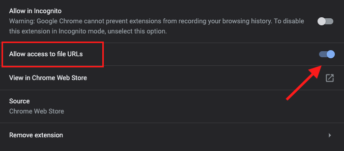

# Project MBS (Marketo Browser Support)

A [Google Chrome Extension](https://chrome.google.com/webstore/detail/marketo-local-browser-sup/iinigaojmcejccagokaolgdfhelkemap?hl=en&authuser=0) for supporting Marketo Guided/Email Templates locally in the browser.

<image src="https://lh3.googleusercontent.com/ViDKK5NlB_IwQPh15yzeeRSyksev_CPGfRTAySf7JhJvhadnsp7dvL3Y8AQDQoC9V1VuEwes66rK5waeL0VlhbOq=w640-h400-e365-rj-sc0x00ffffff" />

## FAQ

#### What does this extension do?

This extension helps speed up the development process for Marketo Guided Landing Page Templates and Marketo Email Templates by automatically populating Marketo Variables in their correct places based on their Default Value in the Meta Tag when viewing the file locally. It will also recognize True/False Values in Boolean Meta Tags and populate the Value within the browser accordingly.

No longer are you having to copy and paste your code within the Marketo Template Editor and clicking on the ‘preview’ option to see your template’s changes - you can now see your changes instantly within your browser!

- This extension works best when ‘Live Previewing’ your code using your favourite text editor!

- This extension will not interfere with the Marketo Software and does not make any changes to your local documents. This extension will only provide a ‘preview’ in your Google Chrome Browser when viewing documents locally that are containing Marketo Variables.

#### How can I install it?

You can install it from the official [Google Chrome Webstore](https://chrome.google.com/webstore/detail/marketo-local-browser-sup/iinigaojmcejccagokaolgdfhelkemap?hl=en&authuser=0).

If you would like cross-browser support or you'd rather not install the extension - you can paste this script directly within your project's code:

```
<script src="https://tyrellcurry.github.io/projectMBS/mbs-chrome-extension/mbs.js"></script>
```

#### Why is the extension not working when I open a local file with Google Chrome from my finder/folder?

You must give the Extension persmission to access the file URLs by toggling this setting:



You can find the Extension's settings by copying and pasting this in your browser:

```chrome://extensions/?id=iinigaojmcejccagokaolgdfhelkemap```

--

### How do I leave my feedback or get support for this extension?
Please fill out this [Google Form](https://forms.gle/mZs2PRuxko7S6bwCA) and I will try to get back to you as soon as possible!

--

### Author

- Created by: [Tyrell Curry](https://github.com/tyrellcurry).

